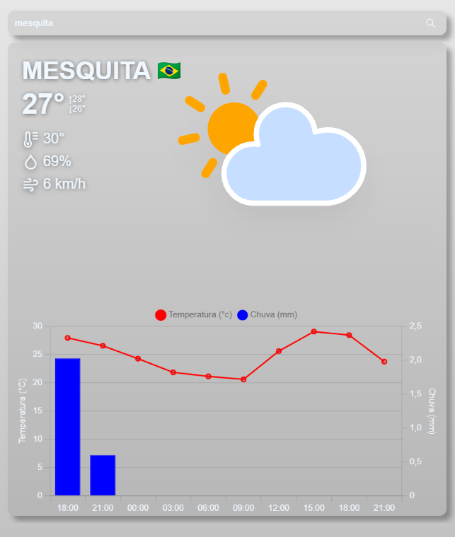
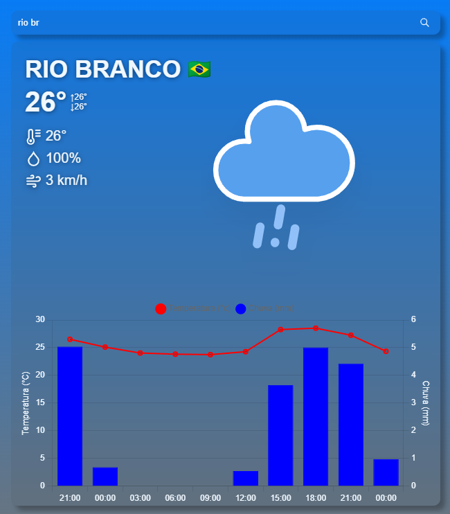
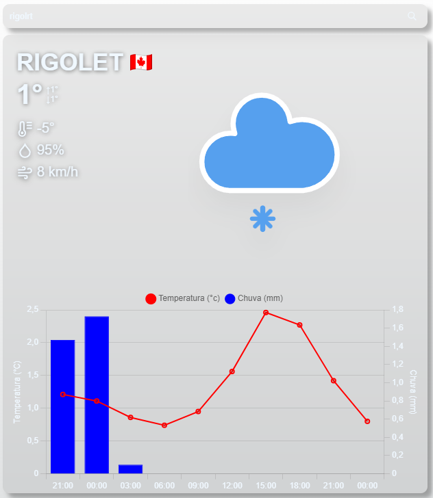
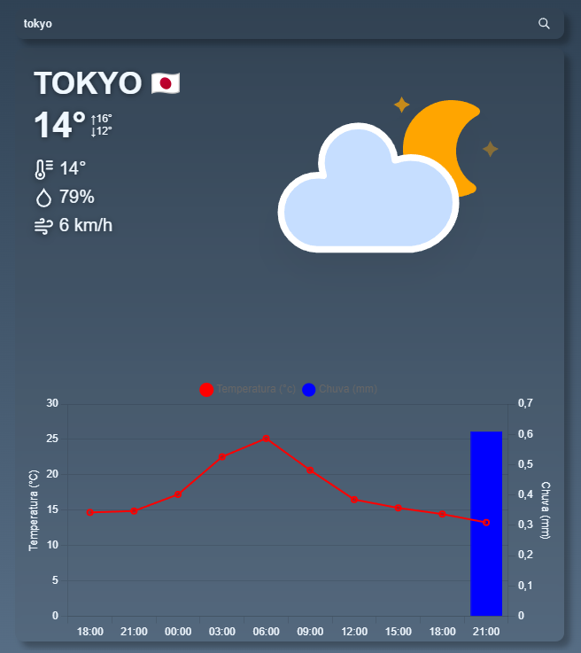

# WeatherWise
WeatherWise é um site que permite visualizar o clima atual e previsões para as próximas horas. Ele utiliza a API do OpenWeatherMap para obter informações meteorológicas em tempo real e a API do Google para autocompletar locais.




## Tecnologias Utilizadas

- React
- Vite (ferramenta de build)
- API do OpenWeatherMap
- API do Google Places Autocomplete
- Chart.js (Biblioteca para renderizar os gráficos)

## Acesso ao Site

Você pode acessar o WeatherWise clicando [aqui](https://maxwel-batalha-weatherwise.onrender.com/).

## Instalação

Para começar a usar o WeatherWise, siga estas etapas simples:

1. Clone este repositório:

    ```bash
    git clone https://github.com/MaxwelLopes/WeatherWise.git
    cd WeatherWise
    ```

2. Instale as dependências do projeto:

    ```bash
    npm install
    ```

3. Crie um arquivo `.env` na raiz do projeto e adicione suas chaves de API:

    ```
    VITE_KEY='SUA_KEY_DO_OPENWEATHERMAP'
    VITE_KEY_GOOGLE='SUA_KEY_DO_GOOGLE'
    ```

## Como Usar

Após a instalação, você pode iniciar o servidor de desenvolvimento com o seguinte comando:

```bash
npm run dev`
```


## Créditos de Atribuição

Os ícones de clima utilizados neste projeto são fornecidos pela [amCharts](https://www.amcharts.com/free-animated-svg-weather-icons/) e estão licenciados sob [CC BY 4.0](https://creativecommons.org/licenses/by/4.0/). Esses ícones fornecem representações visuais dos diferentes tipos de condições climáticas, adicionando uma camada adicional de informação ao nosso aplicativo WeatherWise.


